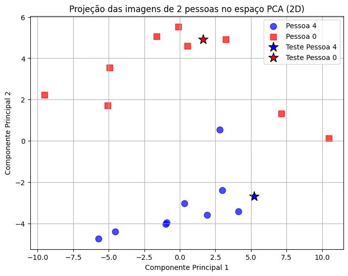
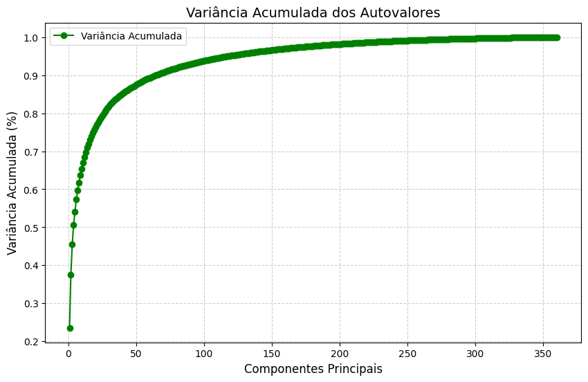
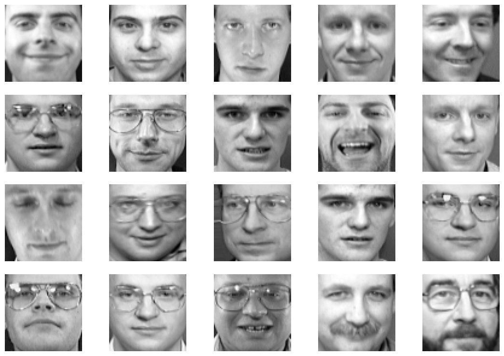
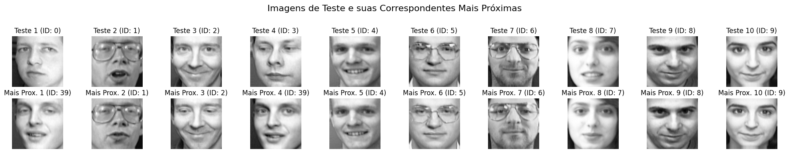

# Eigenfaces para Reconhecimento Facial

Este projeto implementa **Análise de Componentes Principais (PCA)** para reconhecimento facial utilizando o dataset **Olivetti Faces** da biblioteca `scikit-learn`.
Foi desenvolvido como **Trabalho Final** da disciplina **Computação Científica e Análise de Dados** na UFRJ.

---

## Objetivo

Explorar a aplicação do PCA na obtenção de **Eigenfaces** e no desenvolvimento de um sistema de reconhecimento facial, avaliando o desempenho e discutindo limitações.

---

## Estrutura do Projeto

```
├── notebooks/
│   └── eigenfaces.ipynb  # Notebook principal com a implementação
├── src/
│   └── uteis.py          # Funções auxiliares para visualização e análise
├── relatorio/
│   └── Relatório.pdf     # Documento com explicações e resultados detalhados
├── images/               # Pasta com imagens geradas e utilizadas pelo projeto
└── requirements.txt      # Dependências do projeto
```

---

## Metodologia

O trabalho foi dividido em **duas etapas principais**:

### PCA com 2 Pessoas

* Seleção de imagens de apenas **2 indivíduos**.
* Projeção em 2D para **visualização dos agrupamentos**.
* Teste simples de reconhecimento facial.

**Exemplo de visualização 2D:**


A análise gráfica das duas primeiras componentes principais revela a formação de dois clusters distintos, correspondentes a cada indivíduo. As projeções das imagens de teste (destacadas no gráfico) posicionam-se próximas aos agrupamentos de suas respectivas classes, demonstrando que, mesmo reduzindo drasticamente a dimensionalidade para apenas 2 componentes, o PCA preserva características fundamentais que permitem a distinção entre as faces.

---

### PCA com Todo o Dataset

* Separação de imagens para treino e teste (1 por pessoa para teste).
* Determinação do número de componentes para **95% de variância** (\~118 componentes).
* Projeção das imagens no espaço PCA.
* Classificação via **distância euclidiana**.

**Gráfico da variância acumulada:**


---

## Dataset Utilizado

* **Fonte:** `sklearn.datasets.fetch_olivetti_faces`
* **Formato:**

  * 400 imagens (40 pessoas, 10 fotos cada)
  * Escala de cinza, resolução **64×64 pixels**
  * Valores normalizados entre 0 e 1

**Visualização de amostra do dataset:**


---

## Resultados

* No teste com o dataset completo, o modelo reconheceu **36 de 40 imagens** corretamente (**90% de acerto**).
* Erros ocorreram principalmente em casos com:

  * **Posicionamento do rosto deslocado**
  * **Áreas de fundo semelhantes** entre diferentes pessoas

**Exemplo de pares reconhecidos:**


---

## Melhorias Futuras

* Definir **limiar de similaridade** para melhorar a distinção entre indivíduos.
* Permitir identificação de **rostos não presentes** no dataset.
* Testar métricas de distância alternativas (ex.: **distância do cosseno**).

---

## Tecnologias

* Python
* NumPy
* Matplotlib
* scikit-learn

---

## Como Usar

### Instalação

Recomenda-se o uso de um ambiente virtual para isolar as dependências do projeto.

1.  **Clone o repositório** (caso ainda não tenha feito):
    ```bash
    git clone https://github.com/seu-usuario/eigenfaces-cocada.git
    cd eigenfaces-cocada
    ```

2.  **Crie o ambiente virtual**:
    ```bash
    # Windows
    python -m venv venv
    ```

3.  **Ative o ambiente virtual**:
    ```bash
    # Windows (PowerShell)
    .\venv\Scripts\activate
    # Windows (Command Prompt)
    .\venv\Scripts\activate.bat
    ```

4.  **Instale as dependências**:
    ```bash
    pip install -r requirements.txt
    ```

### Execução

As análises e implementações principais estão no Jupyter Notebook.

1.  **Inicie o Jupyter Notebook**:
    ```bash
    jupyter notebook
    ```

2.  **Abra o notebook**:
    *   No navegador que abrirá, navegue até a pasta `notebooks/`.
    *   Clique em `eigenfaces.ipynb` para abrir.

3.  **Execute as células**:
    *   Você pode rodar todas as células sequencialmente para reproduzir os resultados e visualizar os gráficos gerados.
